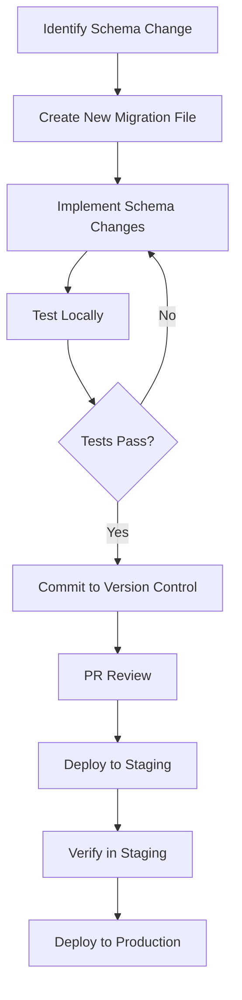

# 📦 ScaleMate Database & Migration Guide

This comprehensive document outlines both our database models and how we manage database evolution through SQL migrations, RLS policies, and Supabase integration. It serves as the single source of truth for database structure and management.

## 📋 Table of Contents
- [Data Models](#-data-models)
- [TypeScript Interfaces](#-typescript-interfaces)
- [Enums & Constants](#-enums--constants)
- [File & Folder Architecture](#-file--folder-architecture)
- [SQL File Naming Rules](#-sql-file-naming-rules)
- [RLS Policy Setup](#-rls-policy-setup)
- [SQL Conventions](#-sql-conventions)
- [Development Process](#-development-process)
- [Common Patterns](#-common-patterns)
- [Migration Execution](#-migration-execution)
- [Troubleshooting](#-troubleshooting)
- [Backup & Version Control](#-backup--version-control)
- [Example Templates](#-example-templates)

---

## 📊 Data Models

### Users
```sql
CREATE TABLE users (
  id UUID PRIMARY KEY DEFAULT uuid_generate_v4(),
  email VARCHAR(255) UNIQUE NOT NULL,
  password_hash VARCHAR(255) NOT NULL,
  full_name VARCHAR(255) NOT NULL,
  role VARCHAR(50) NOT NULL,
  created_at TIMESTAMP WITH TIME ZONE DEFAULT NOW(),
  updated_at TIMESTAMP WITH TIME ZONE DEFAULT NOW(),
  last_login TIMESTAMP WITH TIME ZONE,
  is_active BOOLEAN DEFAULT true
);
```

### Teams
```sql
CREATE TABLE teams (
  id UUID PRIMARY KEY DEFAULT uuid_generate_v4(),
  name VARCHAR(255) NOT NULL,
  description TEXT,
  owner_id UUID REFERENCES users(id),
  created_at TIMESTAMP WITH TIME ZONE DEFAULT NOW(),
  updated_at TIMESTAMP WITH TIME ZONE DEFAULT NOW(),
  is_active BOOLEAN DEFAULT true
);
```

### Team Members
```sql
CREATE TABLE team_members (
  id UUID PRIMARY KEY DEFAULT uuid_generate_v4(),
  team_id UUID REFERENCES teams(id),
  user_id UUID REFERENCES users(id),
  role VARCHAR(50) NOT NULL,
  permissions JSONB,
  created_at TIMESTAMP WITH TIME ZONE DEFAULT NOW(),
  updated_at TIMESTAMP WITH TIME ZONE DEFAULT NOW(),
  UNIQUE(team_id, user_id)
);
```

### Workflows
```sql
CREATE TABLE workflows (
  id UUID PRIMARY KEY DEFAULT uuid_generate_v4(),
  name VARCHAR(255) NOT NULL,
  description TEXT,
  team_id UUID REFERENCES teams(id),
  created_by UUID REFERENCES users(id),
  created_at TIMESTAMP WITH TIME ZONE DEFAULT NOW(),
  updated_at TIMESTAMP WITH TIME ZONE DEFAULT NOW(),
  is_active BOOLEAN DEFAULT true
);
```

### Tasks
```sql
CREATE TABLE tasks (
  id UUID PRIMARY KEY DEFAULT uuid_generate_v4(),
  workflow_id UUID REFERENCES workflows(id),
  name VARCHAR(255) NOT NULL,
  description TEXT,
  status VARCHAR(50) NOT NULL,
  assigned_to UUID REFERENCES users(id),
  created_by UUID REFERENCES users(id),
  created_at TIMESTAMP WITH TIME ZONE DEFAULT NOW(),
  updated_at TIMESTAMP WITH TIME ZONE DEFAULT NOW(),
  due_date TIMESTAMP WITH TIME ZONE
);
```

### Automation Rules
```sql
CREATE TABLE automation_rules (
  id UUID PRIMARY KEY DEFAULT uuid_generate_v4(),
  name VARCHAR(255) NOT NULL,
  description TEXT,
  trigger_type VARCHAR(50) NOT NULL,
  trigger_conditions JSONB,
  actions JSONB,
  created_by UUID REFERENCES users(id),
  created_at TIMESTAMP WITH TIME ZONE DEFAULT NOW(),
  updated_at TIMESTAMP WITH TIME ZONE DEFAULT NOW(),
  is_active BOOLEAN DEFAULT true
);
```

---

## 💻 TypeScript Interfaces

### User
```typescript
interface User {
  id: string;
  email: string;
  fullName: string;
  role: UserRole;
  createdAt: Date;
  updatedAt: Date;
  lastLogin?: Date;
  isActive: boolean;
}
```

### Team
```typescript
interface Team {
  id: string;
  name: string;
  description?: string;
  ownerId: string;
  createdAt: Date;
  updatedAt: Date;
  isActive: boolean;
}
```

### TeamMember
```typescript
interface TeamMember {
  id: string;
  teamId: string;
  userId: string;
  role: TeamRole;
  permissions: Record<string, boolean>;
  createdAt: Date;
  updatedAt: Date;
}
```

### Workflow
```typescript
interface Workflow {
  id: string;
  name: string;
  description?: string;
  teamId: string;
  createdBy: string;
  createdAt: Date;
  updatedAt: Date;
  isActive: boolean;
}
```

### Task
```typescript
interface Task {
  id: string;
  workflowId: string;
  name: string;
  description?: string;
  status: TaskStatus;
  assignedTo?: string;
  createdBy: string;
  createdAt: Date;
  updatedAt: Date;
  dueDate?: Date;
}
```

### AutomationRule
```typescript
interface AutomationRule {
  id: string;
  name: string;
  description?: string;
  triggerType: TriggerType;
  triggerConditions: Record<string, any>;
  actions: Record<string, any>;
  createdBy: string;
  createdAt: Date;
  updatedAt: Date;
  isActive: boolean;
}
```

---

## 🏷️ Enums & Constants

### UserRole
```typescript
enum UserRole {
  ADMIN = 'admin',
  MANAGER = 'manager',
  MEMBER = 'member'
}
```

### TeamRole
```typescript
enum TeamRole {
  OWNER = 'owner',
  ADMIN = 'admin',
  MEMBER = 'member'
}
```

### TaskStatus
```typescript
enum TaskStatus {
  TODO = 'todo',
  IN_PROGRESS = 'in_progress',
  REVIEW = 'review',
  DONE = 'done'
}
```

### TriggerType
```typescript
enum TriggerType {
  SCHEDULE = 'schedule',
  EVENT = 'event',
  CONDITION = 'condition'
}
```

---

## 📐 File & Folder Architecture

```
/supabase
├── migrations/             # SQL files in versioned order
├── policies/               # RLS definitions per table
├── roles/                  # Custom Postgres roles if needed
├── edge-functions/         # Supabase edge function logic (TS or SQL)
├── seed/                   # Optional seeding files for local test/dev
├── types/                  # Generated TypeScript types from database
└── backups/                # Database snapshots and backups
```

### Purpose of Each Directory

| Directory         | Purpose                                                                      |
|-------------------|------------------------------------------------------------------------------|
| migrations/       | Sequentially applied SQL files that build the database schema                |
| policies/         | Row Level Security (RLS) policies organized by table                         |
| roles/            | Custom Postgres roles for fine-grained access control                        |
| edge-functions/   | Serverless functions for custom API endpoints and data processing            |
| seed/             | Data initialization scripts for development and testing                       |
| types/            | TypeScript type definitions generated from the database schema                |
| backups/          | Database snapshots and backup files                                          |

---

## 🧾 SQL File Naming Rules

### ✅ Standard Format:
`###_action_target.sql`

- **###**: Sequential number (e.g., 001, 002)
- **action**: What the migration does (e.g., create, add, update, drop)
- **target**: The object being modified (e.g., users_table, role_enum, quotes_views)

### ✅ Examples:
| File Name                             | Purpose                        |
|--------------------------------------|--------------------------------|
| 001_initial_schema.sql               | Tables + enums + seed data     |
| 002_add_users_table.sql              | Add users table                |
| 003_add_quotes_and_roles.sql         | Quotes + roles tables          |
| 004_add_rls_policies.sql             | RLS policies for all core tables |
| 005_create_edge_user_events.sql      | Edge functions for event logs  |
| 006_add_course_progress_tracking.sql | Courses + user progress        |

### ❌ Avoid These Patterns:
| Bad File Name                         | Why It's Problematic                      |
|--------------------------------------|------------------------------------------|
| update_db.sql                        | Non-specific, no ordering                 |
| april_8_changes.sql                  | Date-based instead of sequential          |
| fix_stuff.sql                        | Vague purpose                             |
| add-user-quotes-profiles.sql         | Too many concerns in one file             |

---

## 🛡 RLS Policy Setup

### Organization
```
/supabase/policies
├── users_rls.sql
├── teams_rls.sql
├── workflows_rls.sql
├── tasks_rls.sql
└── shared_rls_functions.sql
```

### Standard RLS File Structure

Each policy file should include:

```sql
-- Enable RLS on table
alter table "public"."table_name" enable row level security;

-- Clear any existing policies (useful for updates)
drop policy if exists "policy_name" on "public"."table_name";

-- Define policies
create policy "Users can view their own data"
  on "public"."table_name"
  for select
  using (auth.uid() = user_id);

create policy "Users can update their own data"
  on "public"."table_name"
  for update
  using (auth.uid() = user_id)
  with check (auth.uid() = user_id);

-- Add admin policies if needed
create policy "Admins can view all data"
  on "public"."table_name"
  for select
  using (is_admin() = true);
```

### Common RLS Functions

Create a `shared_rls_functions.sql` file with reusable functions:

```sql
-- Check if user is an admin
create or replace function is_admin()
returns boolean as $$
  select exists (
    select 1 from public.users
    where id = auth.uid() and role = 'admin'
  );
$$ language sql security definer;

-- Check if user belongs to a team
create or replace function is_team_member(team_id uuid)
returns boolean as $$
  select exists (
    select 1 from public.team_members
    where user_id = auth.uid() and team_id = team_id
  );
$$ language sql security definer;
```

---

## 🧠 SQL Conventions

### 📚 Table Naming
- Use snake_case for all database objects: `user_roles`, `team_members`, `workflow_tasks`
- Prefix related tables with a common term: `task_comments`, `task_attachments`, `task_history`
- Use plural for collection tables: `users`, `teams`, `workflows`
- Use singular for junction tables: `team_member`, `workflow_assignment`

### 📅 Timestamp Standards
- Always include a `created_at` timestamp column (default `now()`)
- Include `updated_at` timestamp with trigger for auto-updates
- Consider adding `deleted_at` for soft deletes where appropriate
- Use standard timestamp setup:

```sql
create table "public"."users" (
  "id" uuid primary key default uuid_generate_v4(),
  "email" text unique,
  "created_at" timestamp with time zone default now(),
  "updated_at" timestamp with time zone default now(),
  "deleted_at" timestamp with time zone
);

-- Add auto-update trigger for updated_at
create trigger set_updated_at
before update on "public"."users"
for each row
execute procedure update_timestamp();
```

### 🔑 Key Relationships
- Use `user_id` as the foreign key for user-scoped tables
- Ensure all foreign keys have appropriate indexes
- Follow this format for foreign keys:

```sql
create table "public"."profiles" (
  "id" uuid primary key default uuid_generate_v4(),
  "user_id" uuid references "public"."users"(id) on delete cascade,
  "display_name" text,
  "created_at" timestamp with time zone default now()
);

create index profiles_user_id_idx on "public"."profiles"(user_id);
```

### 🔐 RLS Rule Logic

#### User-Based Access
```sql
create policy "Users can only read their own data"
  on "public"."profiles"
  for select
  using (auth.uid() = user_id);
```

#### Role-Based Access
```sql
create policy "Admins can read all profiles"
  on "public"."profiles"
  for select
  using (
    exists (
      select 1 from "public"."users"
      where id = auth.uid() and role = 'admin'
    )
  );
```

#### Team-Based Access
```sql
create policy "Users can read their team's workflows"
  on "public"."workflows"
  for select
  using (
    exists (
      select 1 from "public"."team_members"
      where user_id = auth.uid() and team_id = workflows.team_id
    )
  );
```

---

## 🔄 Development Process

### 1. Local Development Workflow



### 2. Migration Creation Steps

1. **Create numbered migration file**
   ```bash
   # Manual approach
   touch supabase/migrations/007_add_teams_tables.sql
   
   # Using Supabase CLI
   supabase migration new add_teams_tables
   ```

2. **Write SQL changes with proper documentation**
   ```sql
   -- Description: This migration adds team support
   -- Author: Developer Name
   -- Date: 2023-04-08
   
   -- Create teams table
   create table "public"."teams" (
     "id" uuid primary key default uuid_generate_v4(),
     "name" text not null,
     "description" text,
     "owner_id" uuid references "public"."users"(id),
     "created_at" timestamp with time zone default now(),
     "updated_at" timestamp with time zone default now(),
     "is_active" boolean default true
   );
   
   -- Comments for future developers
   -- Team members junction table
   create table "public"."team_members" (
     "id" uuid primary key default uuid_generate_v4(),
     "team_id" uuid references "public"."teams"(id) on delete cascade,
     "user_id" uuid references "public"."users"(id) on delete cascade,
     "role" text not null,
     "permissions" jsonb,
     "created_at" timestamp with time zone default now(),
     "updated_at" timestamp with time zone default now(),
     unique("team_id", "user_id")
   );
   
   -- Create indexes for performance
   create index team_members_team_id_idx 
     on "public"."team_members"(team_id);
   create index team_members_user_id_idx 
     on "public"."team_members"(user_id);
   ```

3. **Test migration locally**
   ```bash
   supabase db reset
   ```

4. **Update RLS policies**
   ```bash
   # Create RLS policy file for new tables
   touch supabase/policies/teams_rls.sql
   ```

5. **Update TypeScript types**
   ```bash
   supabase gen types typescript --local > supabase/types/database.types.ts
   ```

---

## 🧩 Common Patterns

### Soft Delete Implementation
```sql
-- Add deleted_at column
alter table "public"."users" add column if not exists
  "deleted_at" timestamp with time zone;

-- Create soft delete function
create or replace function soft_delete()
returns trigger as $$
begin
  update "public"."users" set 
    deleted_at = now(),
    email = 'deleted_' || id || '@example.com'
  where id = old.id;
  return null;
end;
$$ language plpgsql security definer;

-- Create trigger
create trigger before_delete_user
before delete on "public"."users"
for each row execute procedure soft_delete();

-- Update RLS to exclude deleted
create policy "Hide soft-deleted users"
  on "public"."users"
  for select
  using (deleted_at is null);
```

### Full Text Search Implementation
```sql
-- Add search vector column
alter table "public"."workflows" add column if not exists
  "search_vector" tsvector;

-- Create update function
create or replace function workflows_search_update()
returns trigger as $$
begin
  new.search_vector = 
    setweight(to_tsvector('english', coalesce(new.name, '')), 'A') ||
    setweight(to_tsvector('english', coalesce(new.description, '')), 'B');
  return new;
end;
$$ language plpgsql;

-- Create trigger
create trigger workflows_search_update_trigger
before insert or update on "public"."workflows"
for each row execute procedure workflows_search_update();

-- Create index
create index if not exists workflows_search_idx
  on "public"."workflows" using gin(search_vector);
```

### Enum Creation Pattern
```sql
-- Create enum type
do $$ begin
  create type task_status as enum ('todo', 'in_progress', 'review', 'done');
exception
  when duplicate_object then null;
end $$;

-- Use enum in table
create table "public"."tasks" (
  "id" uuid primary key default uuid_generate_v4(),
  "status" task_status not null default 'todo',
  "created_at" timestamp with time zone default now()
);
```

### Auto-Increment Version Numbers
```sql
-- Create entity with versioning
create table "public"."workflow_versions" (
  "id" uuid primary key default uuid_generate_v4(),
  "workflow_id" uuid references workflows(id),
  "version" integer not null default 1,
  "content" jsonb,
  "created_at" timestamp with time zone default now(),
  "updated_at" timestamp with time zone default now()
);

-- Create version increment function
create or replace function increment_version()
returns trigger as $$
begin
  new.version = old.version + 1;
  new.updated_at = now();
  return new;
end;
$$ language plpgsql;

-- Create trigger
create trigger workflow_versions_increment_version
before update on "public"."workflow_versions"
for each row execute procedure increment_version();
```

---

## 🔨 Migration Execution

### Local Development
```bash
# Apply all migrations
supabase db reset

# View current migration status
supabase migration list

# Generate new migration
supabase migration new add_feature_x
```

### Staging/Production
```bash
# Export migrations from development
supabase db dump -f migrations.sql

# Push migrations to remote
supabase db push

# Check remote migration status
supabase db remote commit
```

### Handling Failed Migrations

1. **Diagnose the issue**
   ```bash
   # Check migration error logs
   supabase logs
   ```

2. **Fix migration file**
   ```bash
   # Edit the problematic migration
   vim supabase/migrations/007_add_teams_tables.sql
   ```

3. **Reset local database and retry**
   ```bash
   supabase db reset
   ```

4. **In production, create a new migration to fix issues**
   ```bash
   # Create fix migration
   supabase migration new fix_teams_tables
   ```

---

## 🔍 Troubleshooting

### Common Issues and Solutions

| Issue                              | Solution                                                                 |
|------------------------------------|--------------------------------------------------------------------------|
| Migration fails with syntax error  | Check SQL syntax; test each statement separately                         |
| Foreign key constraint violation   | Ensure referenced tables/rows exist before creating FK                   |
| Duplicate column/table name        | Add `if not exists` clauses to prevent errors                           |
| Unable to drop required column     | Create a new column, migrate data, then drop old column                  |
| Table already exists               | Add `if not exists` to create table statements                           |
| RLS policy errors                  | Verify policy using/with check clauses match expected columns            |
| Type creation fails                | Use `do $$ begin/exception` pattern for idempotent type creation         |

### Debugging Queries

```sql
-- Add this to migrations for debugging
do $$ 
begin
  raise notice 'Migration step X completed';
end $$;

-- Test a specific query with explain
explain analyze
select * from "public"."users" 
where email = 'test@example.com';
```

### Rollback Strategies

```sql
-- In case of failure, include rollback statements
-- commented out at the end of your migration

/*
-- Rollback for this migration
drop table if exists "public"."team_members";
drop table if exists "public"."teams";
*/
```

---

## 🔐 Backup & Version Control

### 🧠 Core Principles
- Every change is **backed up, versioned, and traceable**
- GitHub remains the **source of truth**
- Supabase migrations must match `.sql` files in versioned order
- Major logic updates must be snapshot-tested before merging
- Feature backups are tied to Cursor Plan Mode and test platform

### 📁 File + Folder Backup Rules
- All `/supabase/migrations/` changes must have one `.sql` file per change
  - Named: `001_create_users.sql`, `002_add_teams_table.sql`
- All `/prompts/` changes must create a new version JSON if prompt changes
  - Example: `role_builder_v2.json`, `quiz_scorer_v3.json`
- Cursor must not overwrite `.md` docs unless diff is shown

✅ Commit history should show file lineage.

### 🚦 When to Trigger Backups
Trigger backup and Git stage when:
- Schema is updated (SQL or edge logic)
- Prompt is modified
- Layout or major component is replaced
- Doc structure or test scaffolding changes
- AI prompt, migration, or feature plan is approved

### 💽 Git Workflow with Migrations

1. **Branch naming convention**
   ```
   feature/add-teams-schema
   bugfix/fix-workflow-search-index
   ```

2. **Commit messages**
   ```
   feat(db): Add teams tables and relationships
   fix(db): Fix search index on workflows table
   ```

3. **Pull Request template for DB changes**
   ```markdown
   ## Database Changes
   
   - [ ] New tables: teams, team_members
   - [ ] New indexes: team_members_team_id_idx
   - [ ] RLS policies: teams_rls.sql
   
   ## Testing
   
   - [ ] Local migrations applied successfully
   - [ ] Type generation completed
   - [ ] CRUD operations tested
   ```

### 🛡️ Supabase + DB Snapshots
- Weekly backups of production and staging databases
- Automatic on schema migration
- Stored in GitHub (via migration files) and in Supabase dashboard

✅ Use named tags on major schema milestones (e.g. `v1-schema-core`)

### ✍️ Backup Tracking Document
Maintain a backup summary log in:
`/docs/backup-history.md`
- Date
- Type (Schema, Prompt, Doc, Layout)
- File or Folder Affected
- Backup Reference (Git commit, Supabase snapshot, filename)

Example:
- 2023-04-08 | Schema | users + teams | 004_add_teams_table.sql
- 2023-04-08 | Prompt | workflow_builder | workflow_builder_v2.json

### ⚠️ Backup is Required Before:
- Deploying to production
- Modifying AI agents
- Changing XP, badge, or quiz scoring systems
- Renaming or removing folders
- Auto-migrations or dynamic schema patches

Cursor must confirm backup before running critical updates.

### ✅ Summary Checklist

| Action                             | Requires Backup? | Reference In               |
|------------------------------------|------------------|----------------------------|
| New table or migration             | ✅                | /supabase/migrations/      |
| Prompt update                      | ✅                | /prompts/version.json      |
| Layout or component restructure    | ✅                | PR + /docs/backup-history  |
| Feature release                    | ✅                | test-platform.md           |
| RLS or security policy changes     | ✅                | /supabase/rls-policies.md  |
| Text or doc edit (minor)           | ❌                |                            |

---

## 📝 Example Templates

### Basic Table Creation
```sql
-- 001_create_workflows_table.sql
create extension if not exists "uuid-ossp";

create table "public"."workflows" (
  "id" uuid primary key default uuid_generate_v4(),
  "name" text not null,
  "description" text,
  "team_id" uuid references "public"."teams"(id),
  "created_by" uuid references "public"."users"(id),
  "created_at" timestamp with time zone default now(),
  "updated_at" timestamp with time zone default now(),
  "is_active" boolean default true
);

create function update_timestamp()
returns trigger as $$
begin
  new.updated_at = now();
  return new;
end;
$$ language plpgsql;

create trigger workflows_updated_at
before update on "public"."workflows"
for each row execute procedure update_timestamp();

create index workflows_team_id_idx on "public"."workflows"(team_id);
create index workflows_created_by_idx on "public"."workflows"(created_by);
```

### RLS Policy Template
```sql
-- workflows_rls.sql
alter table "public"."workflows" enable row level security;

drop policy if exists "Team members can read workflows" on "public"."workflows";
drop policy if exists "Team members can update workflows" on "public"."workflows";
drop policy if exists "Admins can read all workflows" on "public"."workflows";

-- Team-based access
create policy "Team members can read workflows"
  on "public"."workflows"
  for select
  using (
    exists (
      select 1 from "public"."team_members"
      where user_id = auth.uid() and team_id = workflows.team_id
    )
  );

create policy "Team members can update workflows"
  on "public"."workflows"
  for update
  using (
    exists (
      select 1 from "public"."team_members"
      where user_id = auth.uid() and team_id = workflows.team_id and role in ('owner', 'admin')
    )
  )
  with check (
    exists (
      select 1 from "public"."team_members"
      where user_id = auth.uid() and team_id = workflows.team_id and role in ('owner', 'admin')
    )
  );

-- Admin access
create policy "Admins can read all workflows"
  on "public"."workflows"
  for select
  using (
    exists (
      select 1 from "public"."users"
      where id = auth.uid() and role = 'admin'
    )
  );
```

### Integration with Type System
```typescript
// Generated Supabase Types + Custom Types

// From database/types.ts
export type Workflow = Database['public']['Tables']['workflows']['Row']

// Extended interface with helper methods
export interface WorkflowWithTasks extends Workflow {
  tasks: Task[];
  
  isOwnedBy(userId: string): boolean;
  canBeEditedBy(userId: string, userRole: string): boolean;
  
  addTask(task: Omit<Task, 'id' | 'workflow_id'>): Promise<Task>;
  removeTask(taskId: string): Promise<void>;
}

// Factory function to create typed entities
export function createWorkflow(data: Omit<Workflow, 'id' | 'created_at' | 'updated_at'>): Promise<Workflow> {
  return supabase
    .from('workflows')
    .insert(data)
    .select()
    .single()
    .then(({ data, error }) => {
      if (error) throw error;
      return data as Workflow;
    });
}
```

---

For more detailed backup strategies, refer to the [Backup & Migration Strategy](./backup-history.md) document. 

## 📚 Related Documents

- [API Documentation](./api-documentation.md) - API endpoints and database integration
- [Architecture Overview](./architecture.md) - System architecture and data flow
- [Design System](./design.md) - UI components and data visualization
- [Testing Platform](./testing.md) - Database testing procedures
- [Backup Strategy](./backup-history.md) - Backup procedures and version control
- [Security Guidelines](./security.md) - Data security and access control
- [Deployment Strategy](./deployment.md) - Database deployment procedures
- [Prompt Engineering](./prompt-engineering.md) - AI-assisted database operations
- [In-Memory Bank](./in-memory-bank.md) - Caching and state management

### Memory Bank Documents
- [Active Context](../../memory-bank/activeContext.md) - Current development status and sprint goals
- [Product Context](../../memory-bank/productContext.md) - Product vision, strategy, and feature overview
- [Technical Context](../../memory-bank/techContext.md) - Technology stack and architectural decisions
- [System Patterns](../../memory-bank/systemPatterns.md) - Architecture, implementation patterns, and file structure
- [Project Brief](../../memory-bank/projectbrief.md) - Project overview, objectives, and success criteria
- [Progress Tracking](../../memory-bank/progress.md) - Project milestones and current development status 