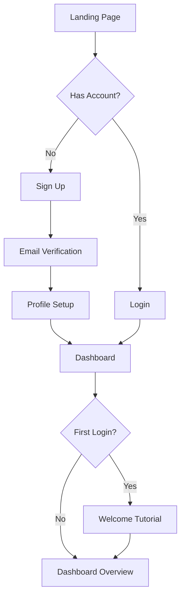
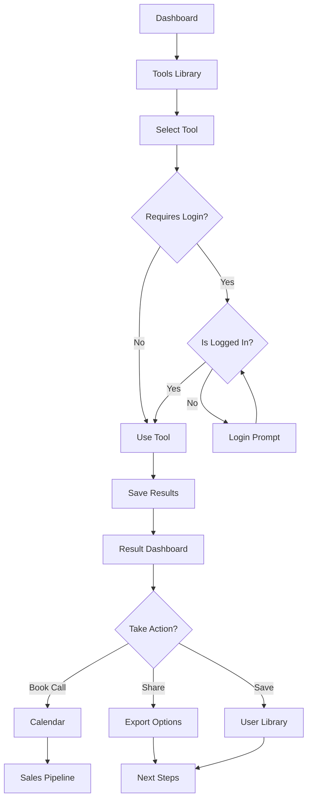
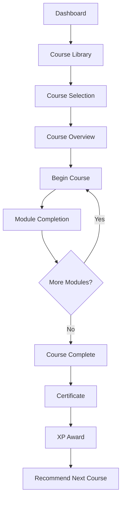
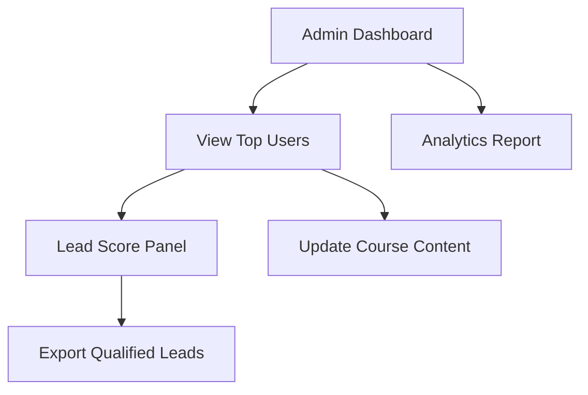

# 🔄 ScaleMate Pages & User Flow

**Version**: v1.0.0  
**Last Updated**: 2024-04-08

## 📋 Table of Contents
1. [Overview](#overview)
2. [Site Map](#site-map)
3. [Core User Journeys](#core-user-journeys)
4. [Page Specifications](#page-specifications)
5. [Navigation Structure](#navigation-structure)
6. [State Transitions](#state-transitions)
7. [User Flow Diagrams](#user-flow-diagrams)
8. [Microcopy Guidelines](#microcopy-guidelines)
9. [A/B Testing](#ab-testing)
10. [Related Documents](#related-documents)

## 📝 Overview

This document outlines all user-facing, authenticated, and admin pages within the ScaleMate platform. It defines how users move through the system, what content is gated, and how UX and technical flows align. It serves as the central reference for designers, developers, product managers, QA testers, and prompt engineers to understand the intended user flow and experience.

The document supports:
- Design teams creating UI layouts
- Developers implementing page interactions
- QA teams validating user flows
- Content creators developing microcopy
- Prompt engineers integrating AI assistance

## 🗺️ Site Map

The ScaleMate platform consists of the following main sections:

```
ScaleMate
├── Public Pages (Anonymous)
│   ├── Home
│   ├── About
│   ├── Blog
│   ├── Pricing
│   ├── Contact
│   └── Login/Signup
├── Auth Pages (User)
│   ├── Login
│   ├── Signup
│   ├── Password Reset
│   └── Email Verification
├── Dashboard (Authenticated)
│   ├── Overview
│   ├── Profile
│   ├── Tools
│   ├── Courses
│   └── Achievements
├── Tools (Feature Modules)
│   ├── Quick Quote Calculator
│   ├── Cost Savings Calculator
│   ├── Role Builder Wizard
│   ├── Readiness Quiz
│   └── Tool Library
├── Learning
│   ├── Course Library
│   ├── Course Player
│   ├── Resources
│   └── Certificates
└── Admin (Restricted)
    ├── User Management
    ├── Content Management
    ├── Analytics
    └── System Settings
```

## 🚶 Core User Journeys

### 1. Anonymous to Free User
**Key Path:** Home page → Teaser tools → Signup → Email verification → Dashboard → Quiz → Role Builder

1. User lands on Home page
2. Explores Quick Quote Calculator (limited version)
3. Views pricing or features
4. Signs up for free account
5. Completes email verification
6. Directed to dashboard
7. Prompted to take Readiness Quiz
8. Given personalized tool recommendations
9. User saves first role blueprint

### 2. Free User to Engaged User
**Key Path:** Dashboard → Quiz → Courses → Multiple tools → Achievement badges

1. Free user logs in to dashboard
2. Takes Readiness Quiz
3. Receives readiness score
4. Unlocks basic training modules
5. Completes first course
6. Uses Role Builder Wizard
7. Generates role description
8. Discovers Tool Library
9. Saves tools to favorites
10. Earns first achievement badges

### 3. Engaged User to Qualified Lead
**Key Path:** High usage → Course completion → Premium request → Strategy call → Admin lead funnel

1. Engaged user regularly uses tools
2. Completes multiple courses
3. Achieves high XP score
4. Requests premium content
5. Books strategy call
6. Flagged as qualified lead in admin

### 4. Admin User Journey
**Key Path:** Admin login → User activity → Lead scoring → Export → Content updates

1. Admin logs in
2. Checks new user registrations
3. Reviews lead scores
4. Exports qualified leads
5. Updates content
6. Reviews platform analytics
7. Adjusts AI prompts
8. Sets new feature flags

## 📄 Page Specifications

### Home Page
- **Purpose**: Introduce ScaleMate, capture leads
- **Key Components**:
  - Hero section with value proposition
  - Quick Quote Calculator (teaser)
  - Feature highlights
  - Testimonials
  - Call to action
- **Conversion Goals**:
  - Email signup
  - Free account creation
  - Calculator usage
- **Next Steps**:
  - Sign up
  - Learn more
  - Try calculator

### Blog (Public)
- **Purpose**: SEO content hub and top of funnel traffic driver
- **Key Components**:
  - Category navigation
  - Featured articles
  - Related content
  - Tool/quiz callouts
- **Conversion Goals**:
  - Engagement with multiple articles
  - Tool exploration
  - Email signup
- **Next Steps**:
  - Related articles
  - Try calculator
  - Take quiz preview

### Dashboard Overview
- **Purpose**: Central hub for user activities
- **Key Components**:
  - Greeting with name
  - Progress summary
  - Recommended tools
  - Recent activity
  - Achievement badges
  - Quick access buttons
- **Conversion Goals**:
  - Tool engagement
  - Course progression
  - Profile completion
- **Next Steps**:
  - Take quiz
  - Continue course
  - Try recommended tool

### Quick Quote Calculator
- **Purpose**: Calculate offshore staffing costs
- **Key Components**:
  - Role selector
  - Experience level slider
  - Country selector
  - Currency selector
  - Results display
  - Comparison chart
- **Conversion Goals**:
  - Completed calculation
  - Saved result
  - Shared result
- **Next Steps**:
  - Sign up to save
  - Explore role builder
  - Book strategy call

### Role Builder Wizard
- **Purpose**: Create optimized role descriptions
- **Key Components**:
  - Multi-step form
  - AI suggestion panel
  - Task selector
  - Skill assessment
  - Export options
- **Conversion Goals**:
  - Completed role design
  - Downloaded blueprint
  - Multiple roles created
- **Next Steps**:
  - Save blueprint
  - Share with team
  - Book implementation call

### Readiness Quiz
- **Purpose**: Assess readiness for offshore scaling
- **Key Components**:
  - Multi-step questionnaire
  - Progress indicator
  - Scoring system
  - Results dashboard
  - Recommendation engine
- **Conversion Goals**:
  - Quiz completion
  - Course enrollment
  - Tool exploration
- **Next Steps**:
  - View detailed results
  - Follow recommendations
  - Begin recommended course

### Course Library
- **Purpose**: Educational content hub
- **Key Components**:
  - Course categories
  - Course cards
  - Filter system
  - Progress tracking
  - Featured content
  - XP rewards indicators
  - Premium course previews
- **Conversion Goals**:
  - Course enrollment
  - Course completion
  - Multiple course engagement
- **Next Steps**:
  - Begin course
  - Continue learning
  - Apply knowledge with tools

### Admin Dashboard
- **Purpose**: Platform management
- **Key Components**:
  - User stats
  - Lead scoring
  - Content management
  - Analytics
  - System settings
  - Prompt A/B test toggles
- **Key Metrics**:
  - Conversion rate
  - Engagement score
  - Lead quality
  - Course completion
- **Key Actions**:
  - Export leads
  - Update content
  - Review analytics
  - Adjust settings

## 🧭 Navigation Structure

### Main Navigation (Public)
- Logo (Home)
- Features
- Pricing
- Blog
- About
- Contact
- Login/Sign Up

### Main Navigation (Authenticated)
- Logo (Dashboard)
- Dashboard
- Tools
- Courses
- Resources
- Profile
- Notifications
- Logout

### Dashboard Navigation
- Overview
- Tools
- Courses
- Progress
- Achievements
- Settings

### Admin Navigation
- Dashboard
- Users
- Content
- Analytics
- Settings
- System
- Logs

## 🔄 State Transitions

### Authentication States
1. **Anonymous**: Limited access, public pages only, can use teaser tools
2. **Authenticated**: Full access to free features, dashboard, and tools
3. **Premium**: Access to advanced features, course paths, exports
4. **Admin**: Platform management access, CMS, analytics, lead panel

### User Progression States
1. **New User**: Just registered, minimal activity
2. **Active User**: Regular engagement, using tools
3. **Power User**: High engagement, multiple tools used
4. **Lead Ready**: Qualified for sales conversation

### Tool Usage States
1. **Not Started**: Tool never accessed
2. **Started**: Tool accessed but not completed
3. **Completed**: Tool used to completion
4. **Repeat User**: Multiple uses of the tool
5. **Power User**: Advanced usage patterns

## 📊 User Flow Diagrams

### Authentication Flow



### Tool Usage Flow



### Course Progression Flow



### Admin Flow



## ✍️ Microcopy Guidelines

### Button Text
- Primary actions: "Start Now", "Try Tool", "Book Strategy Call", "Continue", "Complete"
- Secondary actions: "Learn More", "View Result", "Skip", "Save for Later"
- Tertiary actions: "Cancel", "Back", "Help"

### Form Labels
- Clear, concise instructions: "Your Monthly Budget", "Choose a Role"
- Helper text for complex inputs
- Error messages that guide toward resolution: "Oops! Please enter a valid email to continue."

### Notification Copy
- Success messages: Positive reinforcement
- Warning messages: Clear instruction on prevention
- Error messages: Solution-oriented guidance

### Call-to-Action Hierarchy
1. Primary: High contrast, action verb + benefit
2. Secondary: Medium contrast, action-oriented
3. Tertiary: Low contrast, utility function

## 🔍 A/B Testing

### Current Tests
- Homepage headline variations
- CTA button color and text
- Dashboard layout options
- Quiz flow variations
- Course unlock CTA
- Strategy call popups

### Testing Schedule
- New tests launched bi-weekly
- Results evaluated after minimum sample size
- Winning variations implemented monthly

### Key Metrics
- Conversion rate
- Time on page
- Interaction rate
- Progression rate
- Abandonment rate
- Quiz → Course → Call rate

## 📚 Related Documents

### Project Outlines
- [API Documentation](./api-documentation.md) - API endpoints for page data
- [Architecture Overview](./architecture.md) - Technical page implementation
- [Database Guide](./database-guide.md) - Data models for user flows
- [Design System](./design.md) - UI components used in pages
- [Testing Platform](./testing.md) - User flow testing procedures
- [Backup Strategy](./backup-history.md) - Page version history
- [Security Guidelines](./security.md) - Page access control
- [Deployment Strategy](./deployment.md) - Page deployment process
- [In-Memory Bank](./in-memory-bank.md) - State management across pages
- [Prompt Engineering](./prompt-engineering.md) - AI integration in user flows
- [UX Prompts](./ux-prompts.md) - User experience prompt patterns

### Memory Bank Documents
- [Active Context](../../memory-bank/activeContext.md) - Current development status and sprint goals
- [Product Context](../../memory-bank/productContext.md) - Product vision, strategy, and feature overview
- [Technical Context](../../memory-bank/techContext.md) - Technology stack and architectural decisions
- [System Patterns](../../memory-bank/systemPatterns.md) - Architecture, implementation patterns, and file structure
- [Project Brief](../../memory-bank/projectbrief.md) - Project overview, objectives, and success criteria
- [Progress Tracking](../../memory-bank/progress.md) - Project milestones and current development status 